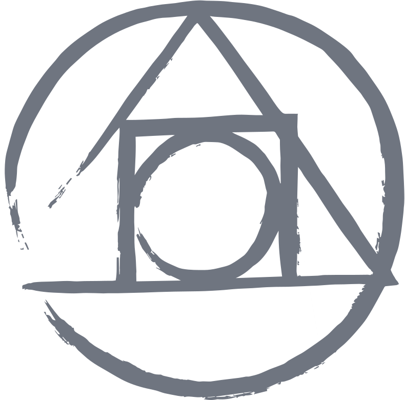

# Hi, nice to meet you! 👋

## Full stack web developper

I started my learning journey about 3 years ago.

- 🌍 I'm based in Canada
- 🧠  I'm currently learning **PHP**.
- ⚡  Driven to keep learning new things everything

---

### I'm currently working on [ngsvirtual.com ✈️](http://ngsvirtual.com)

---

### You can reach out at [robichaudsarah@outlook.com ✉️](mailto:robichaudsarah@outlook.com)

---

### Workflow

---

